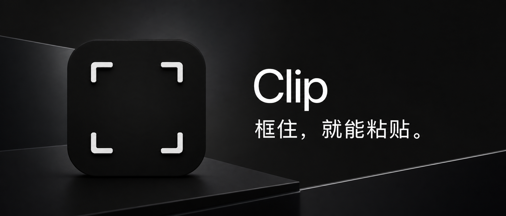
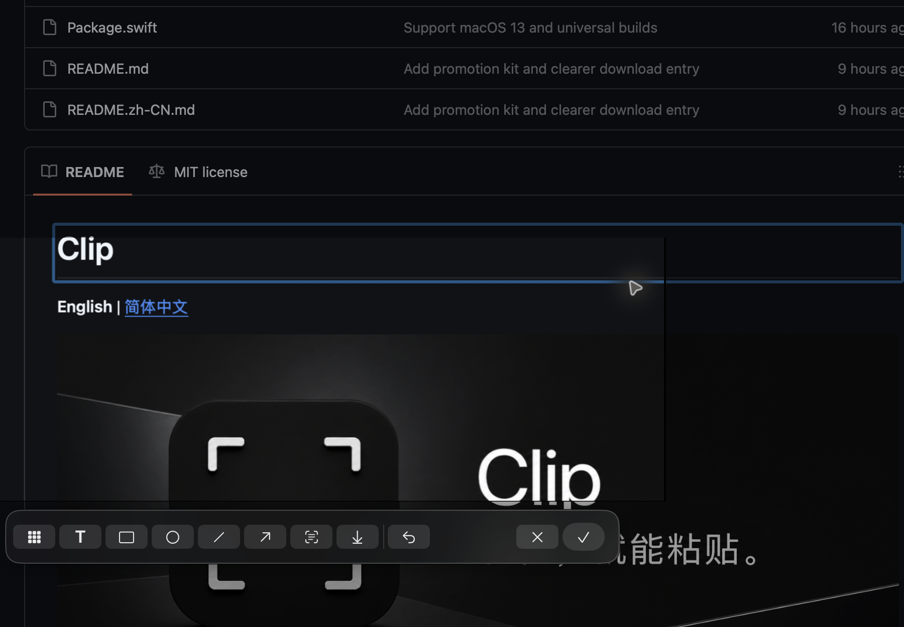
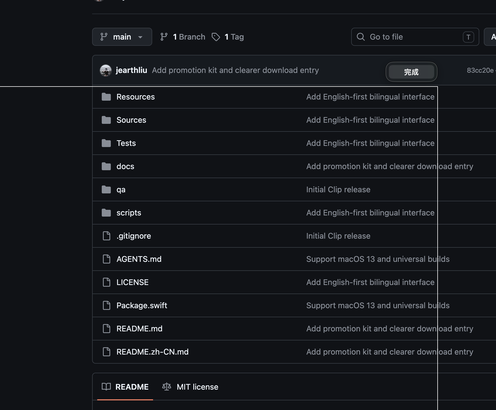
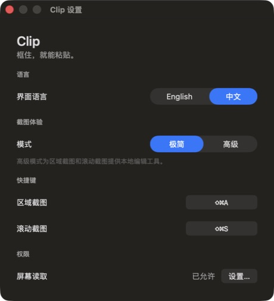

# Clip

[English](README.md) | **简体中文**



**[下载 Clip v0.1.0](https://github.com/jearthliu/clip/releases/download/v0.1.0/Clip-v0.1.0-macOS-universal.zip)** · [安装说明](#安装-github-release) · [反馈问题](https://github.com/jearthliu/clip/issues/new)

Clip 是一款剪贴板优先的 macOS 截图工具，提供两个核心功能：

- 自由框选任意矩形区域，完成后立即复制；
- 在 macOS 能读取、且能通过常规滚动操作移动内容的任意 App 中进行滚动截图。

Clip 完全在本机工作，并且不依赖特定 App。它不会上传截图，也不会为某些 App 编写专用适配器。

> 框选，松开，粘贴。需要时出现，完成后离开。

截图体验分为两种模式：

- 极简：保持最直接的“框选 → 复制”流程。
- 高级：截图完成后在原选区打开编辑界面，选区外保持低亮且不保留边框；按需提供马赛克、聚焦输入的 `T` 文字工具、本地 OCR、矩形和圆形标记、直线和箭头线，以及选区下方的一键下载功能。滚动长图保持选区宽度，可在不缩小图片的情况下纵向浏览。

极简模式的滚动截图流程仍是“框选 → 用户滚动 → 完成 → 复制”。高级模式则会在长图拼接完成后进入同一套标注工具。

界面默认使用英文。打开 **Settings → Language** 即可切换为简体中文；菜单、截图控件、编辑器、权限引导和错误提示会一起切换。

## 实际界面

### 自由框选与标注



选中区域保持明亮，选区外自动压暗。标注工具只在高级模式中出现，并且不会进入最终截图。

### 自己滚动，随时完成



选区固定在桌面上，你继续操作原 App 并正常滚动。Clip 只记录经过选区的变化内容；截到需要的位置后，点击**完成**即可。

### 默认保持简单



## 系统要求

- macOS 13 Ventura 或更高版本
- Apple 芯片或 Intel Mac
- 从源码构建需要 Swift 6.2 或更高版本

## 安装 GitHub Release

1. 从 [Releases 页面](https://github.com/jearthliu/clip/releases)下载 `Clip-v0.1.0-macOS-universal.zip`。
2. 解压后将 `Clip.app` 移到“应用程序”文件夹。
3. 打开 Clip。如果 macOS 阻止首次启动，请前往 **系统设置 → 隐私与安全性**，滚动到“安全性”，找到 Clip 并点击**仍要打开**，然后确认打开。
4. 启动一次截图；macOS 提示时，请允许 Clip 使用**屏幕与系统音频录制**权限。

当前社区版本使用本地代码签名，但**没有使用 Apple Developer ID 签名，也没有通过 Apple 公证**。请只从本仓库的官方 Release 页面下载。不要全局关闭 Gatekeeper。

Clip 的 Apple 芯片 + Intel 通用安装包可以仅使用 Apple Command Line Tools 构建，不强制要求完整 Xcode。当前 Command Line Tools 自带的测试运行器需要显式传入 framework 路径，因此若本机已安装完整 Xcode，测试会更直接。

## 构建和测试

```sh
./scripts/test.sh
./scripts/create-local-signing-identity.sh
./scripts/bundle.sh
open dist/Clip.app
```

`scripts/test.sh` 会自动使用当前选中的完整 Xcode；如果只有 Command Line Tools，它会补充 Testing framework 所需的路径。也可以显式指定 Xcode：

```sh
DEVELOPER_DIR=/Applications/Xcode.app/Contents/Developer ./scripts/test.sh
```

`bundle.sh` 默认生成适用于当前 Mac 的安装包。要生成同时支持 Apple 芯片和 Intel 的通用包，请运行：

```sh
UNIVERSAL=1 ./scripts/bundle.sh
```

首次在本机打包前，请运行一次 `scripts/create-local-signing-identity.sh`。它会在当前用户的登录钥匙串中创建一个仅用于代码签名、名为 `Clip Local Development` 的本地身份。之后 `bundle.sh` 会持续复用该身份，使重新构建的安装包保持稳定的指定要求，让 macOS 隐私权限继续关联到同一 App 身份。如果找不到该身份，打包会明确失败，不会悄悄退回到不稳定的临时签名。

也可以显式选择现有的 Apple Development 或 Developer ID 身份：

```sh
SIGNING_IDENTITY="Apple Development: Your Name (TEAMID)" \
  ./scripts/bundle.sh
```

本地验收或自动化时，可执行文件还支持 `--capture-region`、`--capture-scrolling` 和 `--settings` 参数。

首次使用截图功能时，Clip 会请求屏幕读取权限，macOS 将它放在“屏幕与系统音频录制”中。滚动截图期间，ScreenCaptureKit 只向 Clip 提供内存中的连续屏幕帧；Clip 不编码或保存视频、不模拟滚动输入，也不申请辅助功能权限。高级模式的 OCR 使用本机 Vision 框架，不上传选区像素或识别出的文字。OCR 成功后会关闭编辑器，并将文字保留在剪贴板中。只有用户明确点击下载按钮时，Clip 才会创建图片文件。

## 项目状态

本项目仍在持续开发，并采用 [MIT License](LICENSE) 开源。产品约束见 [PRODUCT.md](docs/PRODUCT.md)，发布前验收标准见 [ACCEPTANCE.md](docs/ACCEPTANCE.md)。
